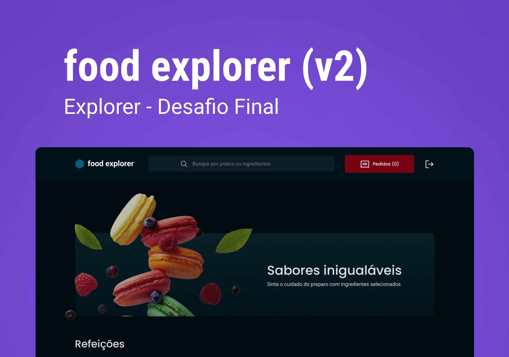
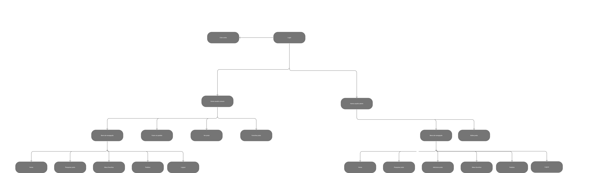

# Food Explorer V2 🍔💻

Food Explorer é um projeto completo de ponta a ponta com um front-end e back-end, desenvolvido usando as tecnologias aprendidas no curso Explorer da Rocketseat. É um aplicativo interativo para um restaurante fictício, onde os usuários podem visualizar pratos, detalhes dos pratos e preços, além de poder favoritar, bem como fazer pedidos e efetuar pagamentos. Enquanto o usuário Admin pode criar, editar e excluir pratos, bem como alterar o status dos pedidos feitos.


## Índice

- [Stack utilizada 🛠️](#stack-utilizada)
- [Funcionalidades 🚀](#funcionalidades)
- [Screenshots 📷](#screenshots)
- [Rodando localmente 💻](#rodando-localmente)
- [Apêndice 📚](#apêndice)
- [Roadmap 🚗](#roadmap)
- [Documentação de cores 🎨](#documentação-de-cores)
- [Licença 📜](#licença)


## Stack utilizada


**ReactJS, JavaScript e Styled Components**

### Bibliotecas 📦

Phosphor Icons, React Icons, Axios, dayjs, React Input Mask, React QR Code, React Router DOM, React Slick, Slick Carousel e Vite.

## Funcionalidades

### Usuário 👥

- Cadastrar-se
- Fazer Login
- Fazer Logout
- Visualizar pratos com seus preços e detalhes
- Visualizar cada prato de forma detalhada
- Pesquisar pratos por ingredientes
- Incluir pratos em seu pedido
- Favoritrar pratos prediletos
- Visualizar pedido com seus pratos incluídos
- Poder remover pratos do pedido e ver o preço total atualizando
- Simular fluxo de pagamento com PIX (Scaneando o QR Code) ou Cartão de Crédito.
- Receber mensagem de pedido enviado após o pagamento.
- Visualizar histórico de pedidos
- Visualizar todos os pratos favoritos

### Admin (Funcionalidades adicionais) 👨‍💼

- Criar Prato
- Editar Prato
- Excluir Prato
- Alterar status de pedidos
## Screenshots

| Capa do Projeto 💡      | Estrutura de Pastas 🔍     |
| ------------- | ------------- |
|  |  |
| SigIn      | SignOut     |
|  |  |
| Home      | Dish     |
|  |  |


## Rodando localmente

Clone o projeto

```bash
  git clone https://github.com/helioLJ/food-explorer-v2
```

Entre no diretório do projeto

```bash
  cd my-project
```

Instale as dependências

```bash
  npm install
```

Inicie o servidor

```bash
  npm run dev
```


## Apêndice





## Roadmap

- Melhorar o suporte de navegadores

- Adicionar mais integrações

## Documentação de cores

| Cor               | Hexadecimal                                                |
| ----------------- | ---------------------------------------------------------------- |
| Cor exemplo       |  #0a192f |
| Cor exemplo       |  #f8f8f8 |
| Cor exemplo       |  #00b48a |
| Cor exemplo       |  #00d1a0 |


## Licença

[MIT](./LICENSE)

